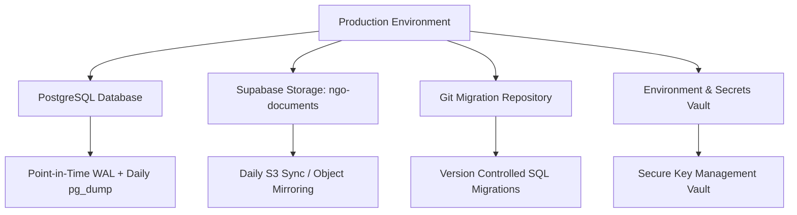

# NGO Portal — Production Backup & Disaster Recovery Runbook

## 1. Overview & Core Philosophy

This runbook outlines the disaster recovery, backup architecture, and restore verification procedures for the NGO Operations & Document Portal.

> [!CAUTION]
> **PostgreSQL database backups do NOT back up Supabase Storage objects.**
> Supabase database snapshots, WAL archives, and `pg_dump` exports back up relational metadata, access control policies, and user profiles. Physical document files (PDFs, scans, Office docs) reside in Supabase Storage (`S3`-compatible object storage) and **must be backed up independently**. Disaster recovery requires coordinated synchronization of both data layers.

---

## 2. Backup Architecture & Components

A complete production recovery state comprises four independent pillars:



### Pillar 1: PostgreSQL Relational Database
* **Managed Automated Backups**: Supabase Pro/Enterprise provides continuous Write-Ahead Log (WAL) archiving with Point-in-Time Recovery (PITR) up to 7-30 days.
* **Secondary Logical Dumps**: Scheduled daily offsite logical backups via `pg_dump`:
  ```bash
  # Daily encrypted logical dump
  pg_dump -h db.<PROJECT-REF>.supabase.co \
          -U postgres \
          -d postgres \
          -F c \
          -f "backup_ngo_$(date +%Y%m%d_%H%M%S).dump"
  ```
* **Retention**: Daily backups retained for 30 days; weekly backups retained for 12 weeks; monthly backups retained for 1 year.

### Pillar 2: Supabase Storage (`ngo-documents`)
* **Bucket Configuration**: Private bucket with object immutability.
* **Independent Replication Strategy**: S3-to-S3 continuous replication or daily incremental synchronization using `rclone` or AWS CLI with S3-compatible credentials:
  ```bash
  # Example daily offsite storage sync
  rclone sync \
    supabase-s3:ngo-documents \
    offsite-backup-vault:ngo-documents-backup/$(date +%Y%m%d)/ \
    --fast-list \
    --transfers 16
  ```
* **Object Path Mapping**: Files are keyed hierarchically as:
  `{organization_id}/{document_id}/{version_id}/{sanitized_filename}`
  This layout guarantees that restoring files to the same bucket preserves all historical versions and relational foreign keys.

### Pillar 3: Git Migration Repository
* The database schema, authorization helpers, triggers, and RLS policies are version-controlled in `supabase/migrations/`.
* Migrations are strictly forward-only and tested via automated CI verification.

### Pillar 4: Environment & Secrets
* `.env.production` variables, Supabase Auth site URLs, email templates, and edge function configurations are stored securely in a password manager/KMS vault (e.g., AWS Secrets Manager, 1Password for Teams).
* **Never commit secrets to git repositories.**

---

## 3. Disaster Recovery & Restore Procedure

In the event of database corruption, ransomware, or regional cloud outages, follow this step-by-step restoration process:

### Step 1: Provision Clean Target Environment
1. Provision a clean Supabase project or PostgreSQL instance (e.g., in a non-production staging or replacement production region).
2. Configure environment credentials (`VITE_SUPABASE_URL`, `SUPABASE_SERVICE_ROLE_KEY`, `VITE_SUPABASE_ANON_KEY`).

### Step 2: Restore Relational Database
* If restoring via PITR: Trigger point-in-time recovery through the Supabase Dashboard / CLI to the desired timestamp before the incident.
* If restoring from logical dump (`pg_dump`):
  ```bash
  pg_restore -h db.<NEW-PROJECT-REF>.supabase.co \
             -U postgres \
             -d postgres \
             --clean \
             --if-exists \
             "backup_ngo_YYYYMMDD_HHMMSS.dump"
  ```
* Apply any incremental migrations from `supabase/migrations/` that occurred after the snapshot timestamp:
  ```bash
  supabase db push
  ```

### Step 3: Restore Storage Objects
1. Verify the private bucket `ngo-documents` exists with `public = false`.
2. Sync backup objects into the new storage bucket:
  ```bash
  rclone copy \
    offsite-backup-vault:ngo-documents-backup/YYYYMMDD/ \
    supabase-s3:ngo-documents \
    --fast-list
  ```

### Step 4: Integrity & Foreign Key Reconciliation
Run verification queries in SQL Editor to confirm referential alignment between documents, versions, and storage paths:

```sql
-- 1. Check for documents with missing current_version_id
SELECT id, title, organization_id, created_at
FROM documents
WHERE current_version_id IS NULL AND is_archived = FALSE;

-- 2. Verify all current versions point to existing document_version records
SELECT d.id, d.title, d.current_version_id
FROM documents d
LEFT JOIN document_versions dv ON dv.id = d.current_version_id
WHERE dv.id IS NULL AND d.current_version_id IS NOT NULL;

-- 3. Check for any storage_path inconsistencies
SELECT dv.id, dv.document_id, dv.storage_path
FROM document_versions dv
WHERE dv.storage_path NOT LIKE dv.organization_id || '/' || dv.document_id || '/%';
```

---

## 4. Recovery Testing Guidance (Non-Production Drills)

Disaster recovery is only theoretical until tested. Conduct quarterly recovery verification drills in an isolated staging environment:

| Step | Verification Task | Expected Result | Pass/Fail Criteria |
| :--- | :--- | :--- | :--- |
| **1** | Database Restoration | Restore database dump into staging environment. | All 23 tables restore with 0 schema errors. |
| **2** | Storage Synchronization | Copy a random 10% sample of storage objects to staging bucket. | Directory tree structure matches `{org}/{doc}/{ver}/file`. |
| **3** | RLS & Policy Audit | Run `npm run test` or integration test suite against staging. | 100% of tables have `rls_enabled = true`. |
| **4** | Cross-Tenant Isolation | Attempt cross-tenant queries between Org A and Org B personas. | Org B queries return 0 records for Org A users. |
| **5** | Persona Login & Session | Authenticate as Super Admin, Secretary, Executive, and Member. | Users log in successfully with correct role permissions. |
| **6** | Document Download Test | Download existing document versions from staging Storage bucket. | File downloads, SHA256 checksum matches original file. |
| **7** | Version Immutability | Attempt to modify existing `document_versions` record via Member account. | Aborted with RLS denial error. |
| **8** | Audit Log Preservation | Verify `activity_logs` records from before the restore are present. | Historical activities intact; DELETE blocked by statement trigger. |

---

## 5. Emergency Contacts & Escalation Matrix

* **Primary Infrastructure Lead**: NGO Portal Technical Operations (`ops@himalayanngo.org`)
* **Supabase Cloud Escalation**: Supabase Support Portal (`support.supabase.com`)
* **Incident Log**: Record all actions, timestamps, and restored database commit IDs in the incident tracking register.
